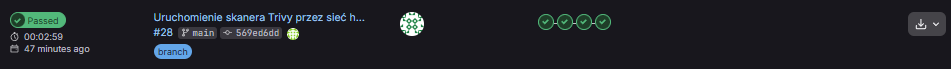
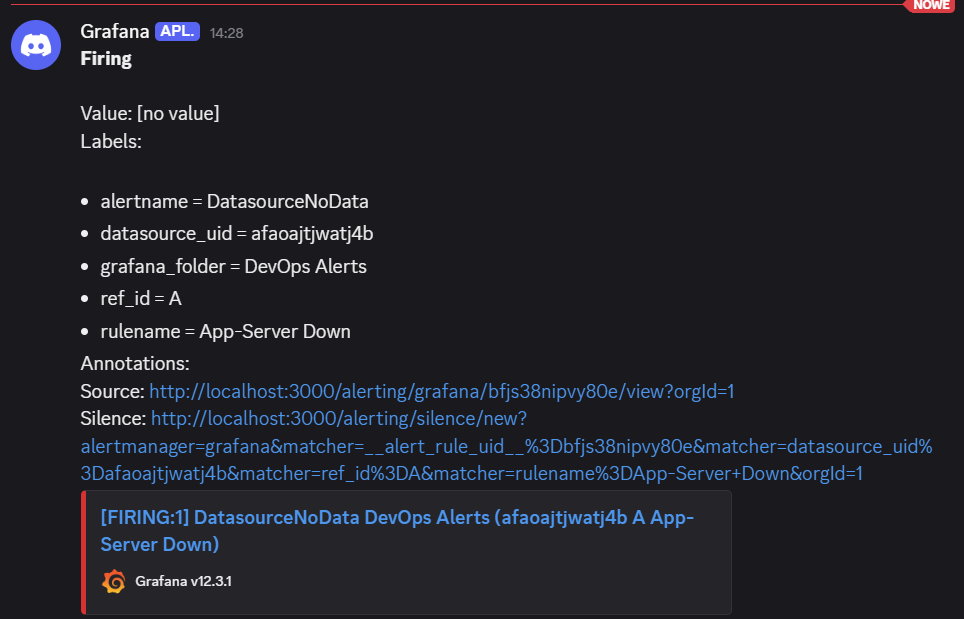
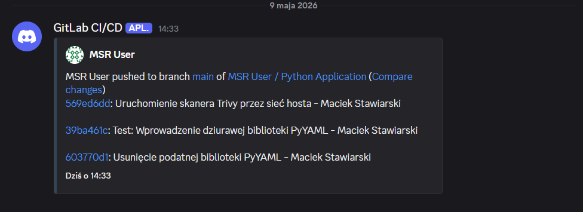
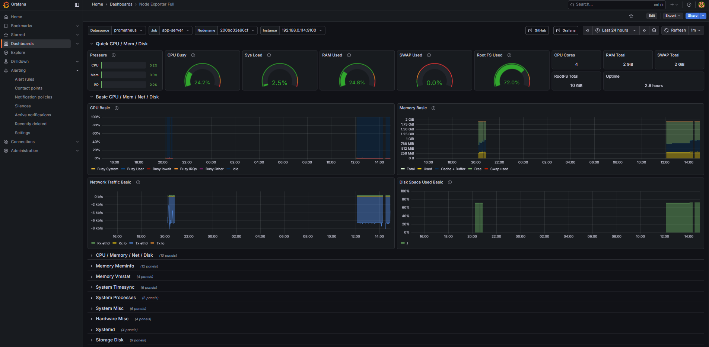

# Secure & Automated DevOps Infrastructure


## Overview
This project showcases a fully automated, secure, and highly available CI/CD pipeline and deployment infrastructure. It demonstrates the complete Software Development Life Cycle (SDLC) from code commit to secure production deployment, enforcing strict quality gates, vulnerability scanning, and secure network routing.

The application itself is a Python (Flask) service backed by a Redis database, entirely containerized and orchestrated via Docker, running behind an NGINX reverse proxy with SSL encryption.

## Architecture

```mermaid
graph TD
    %% Definicje kolorów i stylów
    classDef dev fill:#f9f9f9,stroke:#333,stroke-width:2px;
    classDef gitlab fill:#fca326,stroke:#e24329,stroke-width:2px,color:white;
    classDef pipeline fill:#e1f5fe,stroke:#0288d1,stroke-width:2px;
    classDef prod fill:#e8f5e9,stroke:#2e7d32,stroke-width:2px;
    classDef alert fill:#ffebee,stroke:#c62828,stroke-width:2px;

    subgraph Developer ["Your Environment"]
        Local["💻 VS Code"]:::dev
    end

    subgraph CICD ["GitLab CI/CD"]
        Repo["📦 Repository"]:::gitlab
        Lint["🔍 Flake8 Linting"]:::pipeline
        Build["🐳 Docker Build"]:::pipeline
        Sec["🛡️ Trivy Security Scan"]:::pipeline
        Deploy["🚀 SSH Deploy"]:::pipeline
    end

    subgraph Production ["Production Server"]
        NGINX["🌐 NGINX Reverse Proxy + SSL"]:::prod
        App["🐍 Python Flask App"]:::prod
        DB[("🗄️ Redis Database + AOF")]:::prod
        Cron["⏳ Cron Backup"]:::prod
    end

    subgraph Monitoring ["Monitoring & Alerts"]
        Discord["🚨 Discord Webhook"]:::alert
        Grafana["📊 Grafana Dashboard"]:::alert
    end

    %% Połączenia
    Local -->|"git push"| Repo
    Repo -->|"triggers"| Lint
    Lint -->|"success"| Build
    Build -->|"success"| Sec
    Sec -->|"success"| Deploy
    Deploy -->|"docker-compose up"| NGINX

    NGINX -->|"Proxy pass"| App
    App -->|"Read/Write"| DB
    DB -.->|"dump.rdb backup"| Cron

    Sec -.->|"Failure (CVE)"| Discord
    Deploy -.->|"Status change"| Discord
    
    Grafana -.->|"Metrics collection"| Production
    ```

### Tech Stack & Tools
* **CI/CD:** GitLab CI/CD, GitLab Runners
* **Containerization:** Docker, Docker Compose
* **Reverse Proxy & Security:** NGINX, OpenSSL (Self-Signed Certificates)
* **Backend & DB:** Python (Flask), Redis (AOF Persistence)
* **Quality & Security Gates:** Flake8 (Linter), Trivy (Vulnerability Scanner)
* **Monitoring & Alerts:** Discord Webhooks, Cron (Automated Backups)

## Key Features

* **Automated CI/CD Pipeline:** A robust 4-stage pipeline (`test`, `build`, `security`, `deploy`) triggered on every Git push.
* **Strict Quality Control (Fail Fast):** Integration of **Flake8** to enforce PEP 8 standards. The pipeline immediately halts if syntax rules are violated.
* **Continuous Security Scanning:** Automated Docker image scanning using **Trivy**. The deployment is automatically blocked if any `CRITICAL` CVE vulnerabilities are detected.
* **Secure Reverse Proxy:** **NGINX** acts as a front-facing gatekeeper, completely isolating internal Docker networks, blocking raw HTTP traffic, and forcing **HTTPS** encryption.
* **Data Persistence & Backups:** Redis is configured with Append-Only File (AOF) mode. Automated daily `cron` jobs handle database dumping and secure off-site backup transfers via SCP.
* **Real-time Alerting:** Integrated Discord Webhooks notify the team instantly about pipeline status changes, specifically alerting on failed deployments or security breaches.
* **Zero-Downtime Environment:** Docker containers are configured with `--restart always` policies to ensure high availability.

## Pipeline Stages

1. **`test-code`**: Spins up an isolated environment to lint the Python codebase using Flake8.
2. **`build-image`**: Builds a fresh Docker image containing the application and dependencies, utilizing host networking to bypass virtual bridge bottlenecks.
3. **`security-scan`**: Pulls the latest vulnerability database from GitHub Container Registry (GHCR) and performs a deep scan of the Docker image using Aqua Security's Trivy.
4. **`deploy-job`**: Securely transfers the image and SSL certificates via SSH to the production server and orchestrates the container deployment.

## Showcase

### CI/CD Pipeline

### Real-time Alerts


### Monitoring Dashboard
